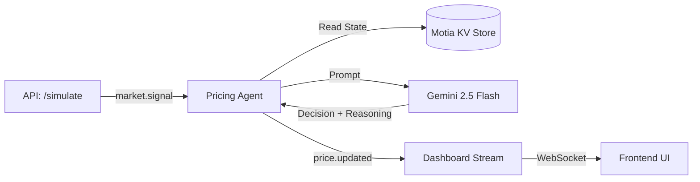

# Motia Surge Pricing Engine

> **A real-time, event-driven pricing engine powered by Motia and Google Gemini 2.5 Flash.**


---

## Overview

This project implements an **autonomous surge pricing engine** that dynamically adjusts product prices in real time based on incoming market signals such as demand surges, competitor price changes, and inventory pressure.

Unlike traditional rule-based systems, this engine leverages **Generative AI** to reason about market context and produce **explainable pricing decisions**. Every price change includes human-readable reasoning, ensuring transparency and auditability.

---

## Architecture

The system is built on a **strict Event-Driven Architecture (EDA)** orchestrated by the Motia runtime.



---

## Core Components

### 1. Signal Ingestion — `simulate.step.ts`

* Exposes a REST endpoint to inject market signals
* Validates request payloads using **Zod**
* Emits `market.signal` events into the Motia event loop

---

### 2. Intelligence Layer — `pricing-agent.step.ts`

* Subscribes to `market.signal` events
* Retrieves persistent context (current price, competitor price, stock level)
* Prompts **Gemini 2.5 Flash** to act as a revenue optimization agent
* Produces price decisions with clear reasoning

---

### 3. Real-Time Delivery — `dashboard.stream.ts`

* Subscribes to `price.updated` events
* Streams decisions to connected frontend clients via **WebSockets**
* Enables live dashboards and monitoring

---

## Setup & Installation

### Prerequisites

* Node.js 18+
* Google Gemini API Key

---

### 1. Clone the Repository

```bash
git clone https://github.com/abhasgawali/SurgePricingEngine.git
cd motia-surge-pricing
```

---

### 2. Install Dependencies

```bash
npm install
```

---

### 3. Environment Configuration

Create a `.env` file in the project root:

```bash
cp .env.example .env
```

Add your Gemini API key:

```env
GEMINI_API_KEY=your_actual_key_here
```

---

### 4. Run the Development Server

```bash
npx motia dev
```

The Motia Workbench will be available at:

```
http://localhost:3000
```

---

## Usage / Demo

Interact with the system through the **Motia Workbench UI** or via `curl`.

---

### Simulate a Demand Surge

```bash
curl -X POST http://localhost:3000/api/simulate \
  -H "Content-Type: application/json" \
  -d '{ "type": "demand_surge", "value": 1.5 }'
```

**Expected Behavior**

* Market signal is ingested
* Pricing agent evaluates context
* Gemini returns a decision with reasoning
* Updated price is broadcast to clients

---

### Simulate Competitor Undercutting

```json
{
  "type": "competitor_price",
  "value": 95.00
}
```

The agent may lower or match pricing depending on current stock and demand context.

---

## Technology Stack

* **Runtime / Framework:** Motia
* **Language:** TypeScript
* **AI Model:** Google Gemini 2.5 Flash
* **Validation:** Zod
* **Architecture:** Event-Driven (EDA)
