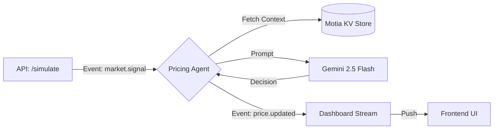

# Motia Surge Pricing Engine

> **A real-time, event-driven pricing system powered by Google Gemini 2.5 Flash and Motia.**


## 📖 Overview

This project implements an autonomous pricing agent that adjusts product prices in real-time based on market signals (demand surges, competitor undercutting, and stock depletion).

Unlike traditional rule-based engines, this system uses **Generative AI** to analyze the context and provide a human-readable explanation for every pricing decision, making the logic transparent and audit-proof.

## 🏗 Architecture

The system follows a strict Event-Driven Architecture (EDA) orchestrated by the Motia runtime.



## 🔧 Core Components

### 1. Signal Ingestion (`simulate.step.ts`)

* Exposes a REST API to inject market events manually
* Validates input using Zod before emitting `market.signal`

### 2. The Intelligence Layer (`pricing-agent.step.ts`)

* Subscribes to `market.signal`
* Retrieves persistent state (Current Price, Competitor Price, Stock)
* Prompts **Gemini 2.5 Flash** to act as a Revenue Manager
* Decides on price changes and generates reasoning

### 3. Real-time Delivery (`dashboard.stream.ts`)

* Subscribes to `price.updated` events
* Broadcasts decisions to connected frontend clients via WebSockets

## 🚀 Setup & Installation

### Prerequisites

* Node.js 18+
* Google Gemini API Key

### 1. Clone the repository

```bash
git clone https://github.com/abhasgawali/SurgePricingEngine.git
cd SurgePricingEngine
```

### 2. Install dependencies

```bash
npm install
```

### 3. Configuration

Create a `.env` file in the root directory:

```bash
cp .env.example .env
```

Add your API key:

```env
GEMINI_API_KEY=your_actual_key_here
```

### 4. Run the Development Server

```bash
npx motia dev
```

## 🧪 Usage / Demo Guide

You can interact with the system entirely through the Motia Workbench (`http://localhost:3000`) or via `curl`.

### 1. Simulate a Demand Surge

Trigger a market signal to see how the AI reacts to high demand.

**Request:**

```bash
curl -X POST http://localhost:3000/api/simulate \
  -H "Content-Type: application/json" \
  -d '{ "type": "demand_surge", "value": 1.5 }'
```

**Expected Result (Logs):**

* `🔌 Manual Signal Injected`
* `🤖 Agent Active: Analyzing demand_surge`
* `🧠 Gemini Decision`: "{ "decision": "increase", "reasoning": "Demand is up 50%..." }"
* `📡 Broadcasting to Frontend`

### 2. Simulate Competitor Undercut

Tell the system a competitor just dropped their price.

**Request:**

```json
{
  "type": "competitor_price",
  "value": 95.00
}
```

**AI Behavior:**
The agent will likely lower the price to match or slightly undercut, depending on the current stock level found in the State.

## 🛠 Tech Stack

* **Framework:** Motia (Event Loop, State Management, API)
* **Language:** TypeScript
* **AI Model:** Google Gemini 2.5 Flash (via REST API)
* **Validation:** Zod
